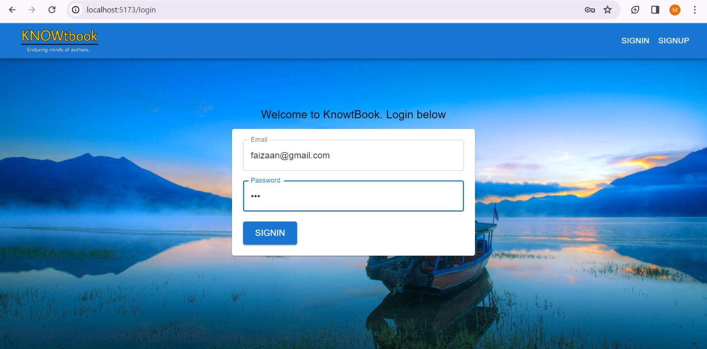
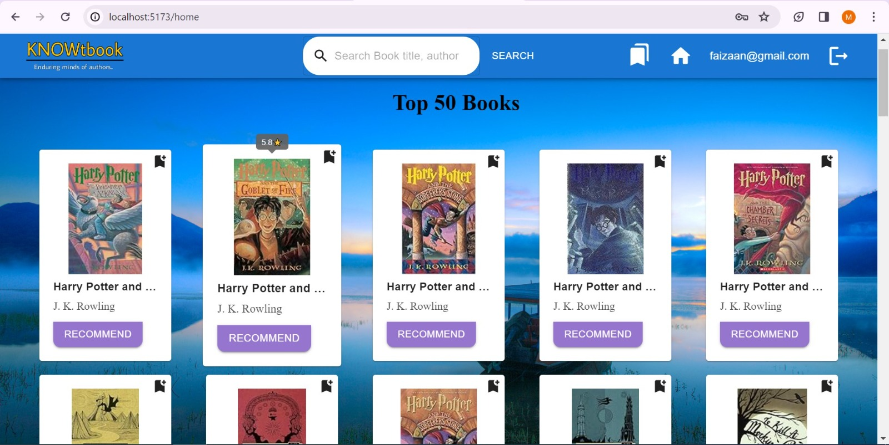
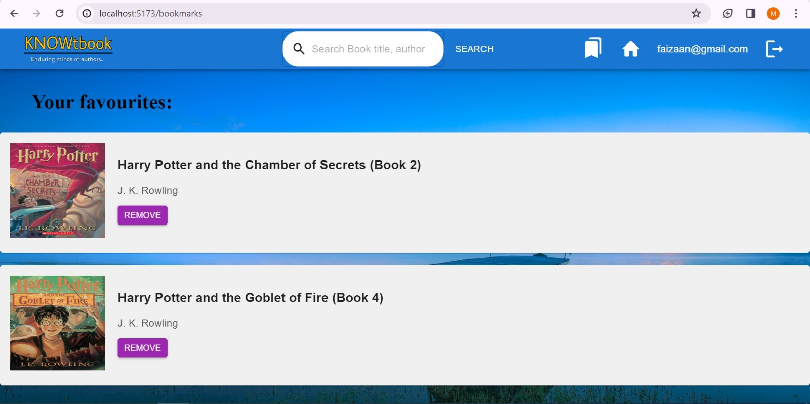

# Book Recommendation System
This project based on machine learning.It is a web-based book recommendation system that leverages collaborative filtering to suggest books to users based on the user ratings to the books. The application includes proper authentication allowing logged-in users to access the web app for one hour. Users can also add books to their favorites for quick access.

## Project Overview
The Book Recommendation System uses collaborative filtering, a popular method for making personalized recommendations by analyzing user interactions with content. When a user logs in, the system recommends books based on the preferences of similar users, enhancing the user experience by providing tailored suggestions. Additionally, users can add books to their favorites list.The recommendation model is built using the k-nearest neighbors (KNN) algorithm.

### Demo images







### Features
- **Collaborative Filtering:** Recommends books based on user behavior and preferences using the KNN algorithm.
- **Authentication:** Secure login with JSON Web Tokens (JWT) and session management, allowing access for one hour.
- **Favorites:** Users can add books to their favorites for quick access.
- **User Interface:** Interactive and user-friendly frontend built with React and Material-UI.
- **API Testing:** APIs tested and documented using Postman.
- **State Management:** Efficient state management using Recoil.
- **Data Preprocessing:** Data cleaned and processed using Jupyter Notebook.

## Technologies Used

### Backend

- **Python Flask:** A lightweight WSGI web application framework to build the backend API.
- **MongoDB:** NoSQL database for storing user data and book information.
- **Jupyter Notebook:** Used for data preprocessing and exploratory data analysis.
- **Postman:** API testing and documentation tool.
- **JSON Web Tokens (JWT):** Used for secure authentication.
- **k-Nearest Neighbors (KNN):** Algorithm used from scikit-learn for building the recommendation model.

### Frontend

- **React:** JavaScript library for building user interfaces.
- **Recoil:** State management library for React applications.
- **Material-UI:** React component library for implementing Google's Material Design.
  
### Additional Tools

- **Git:** Version control system for tracking changes and collaborating with others.
- **GitHub:** Hosting service for version control using Git.

## Prerequisites

Before you begin, ensure you have met the following requirements:

- Python 3.x installed on your machine.
- Node.js and npm (Node Package Manager) installed for frontend dependencies.
- Git for cloning the repository.

## Installation

Follow these steps to get the project up and running on your local machine:

### Backend (Flask API)

1. Clone the repository:
   ```
   git clone https://github.com/yourusername/your-repository.git
   ```
2. Navigate to the backend directory:
   ```
   cd backend
   ``` 
3. Set up a virtual environment (optional but recommended):
   ```
   python -m venv venv
   ```
4. Activate the virtual environment:
   On Windows:
     ```
        venv\Scripts\activate
     ```
   On macOS/Linux:
     ```
        source venv/bin/activate
     ```
5. Install dependencies:
   ```
        pip install -r requirements.txt
   ```
6. Run the Flask application:
   ```
     python app.py
   ```

The backend server will start running at http://localhost:5000

### Frontend (React Application)
1. Navigate to the frontend directory:
   ```
   cd ../frontend
   ```
2. Install dependencies:
   ```
   npm install
   ```
3. Start the React development server:
   ```
   npm run dev
   ```

The frontend server will start running at http://localhost:3000.

## Usage

### Accessing the Application

- **Frontend:** Open your web browser and navigate to [http://localhost:3000].
- **Backend:** The backend API will be running at [http://localhost:5000].

### API Endpoints

The available API endpoints and their usage, such as:

- **POST /api/register:** Register a user in database and start a session using JWT.
- **POST /api/login:** Authenticate a user and start a session using JWT.
- **GET /user/me:** Authenticate user on every hard reload.
- **GET /home:** Retrieve top 50 books for home page.
- **GET /books:** Search specific book.
- **GET /books/<bookname>:** Retrieve a list of recommended books.
- **POST /favorites/add:** Add a book to the user's favorites.
- **GET /favorites:** Retrieve the user's list of favorite books.
- **POST /favorites/delete:** Add a book to the user's favorites.

